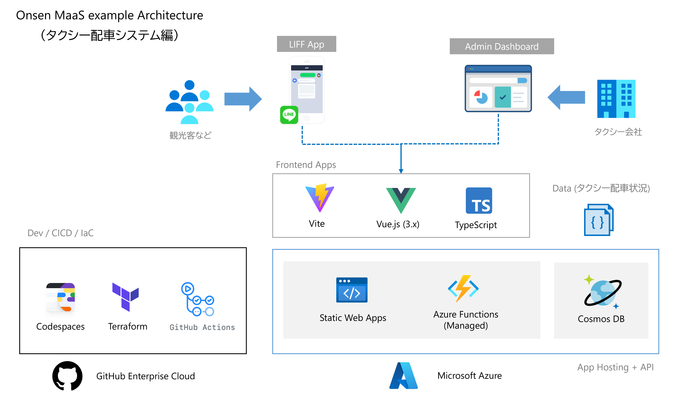

# 【地方活性化！】MaaS Hands-On with Microsoft Azure【ミニアプリ】

このリポジトリは、[【地方活性化！】MaaS Hands-On with Microsoft Azure【ミニアプリ】](https://linedevelopercommunity.connpass.com/event/220376/) で行ったハンズオンをベースに、より実用に即した改良を行ったサンプルコードを格納しています。

## サンプルコード

### アーキテクチャ



### 主要スタック

このサンプルコードでは主に以下のスタックを利用しています。

- [Vue.js](https://v3.ja.vuejs.org/): フロントエンドのフレームワーク (Vue3.x)
- [Vite](https://vitejs.dev/): フロントエンドアプリケーションのビルド
- [TypeScript](https://www.typescriptlang.org/): プロジェクト全体のプログラミング言語として利用
- [LIFF](https://developers.line.biz/ja/docs/liff/): LINE の ログインや Messaging API を利用
- [Azure Static Web Apps](https://docs.microsoft.com/ja-jp/azure/static-web-apps/overview): フロントエンドホスティング + バックエンド API 実行基盤
- [Azure Cosmos DB](https://docs.microsoft.com/ja-jp/azure/cosmos-db/introduction): バックエンドのデータストア
- [GitHub Codespaces](https://github.co.jp/features/codespaces): 開発環境
- [GitHub Actions](https://github.co.jp/features/actions): CI/CD 実行環境
- [Terraform](https://www.terraform.io/): Infrastructure as Code

### ディレクトリ構成

以下のような構成で、Vue.js によるサンプルコードや、ドキュメントを格納しています。

```bash
├── .devcontainer       ... Dev container 構成
├── client              ... ユーザークライアントのコード
├── admin               ... 管理システムのコード
├── docs                ... 資料などドキュメンテーション
├── dev.code-workspace  ... Visual Studio Code のワークスペース設定ファイル
├── iac                 ... Infrastructure as Code のためのコード
└── README.md           ... このファイル
```
