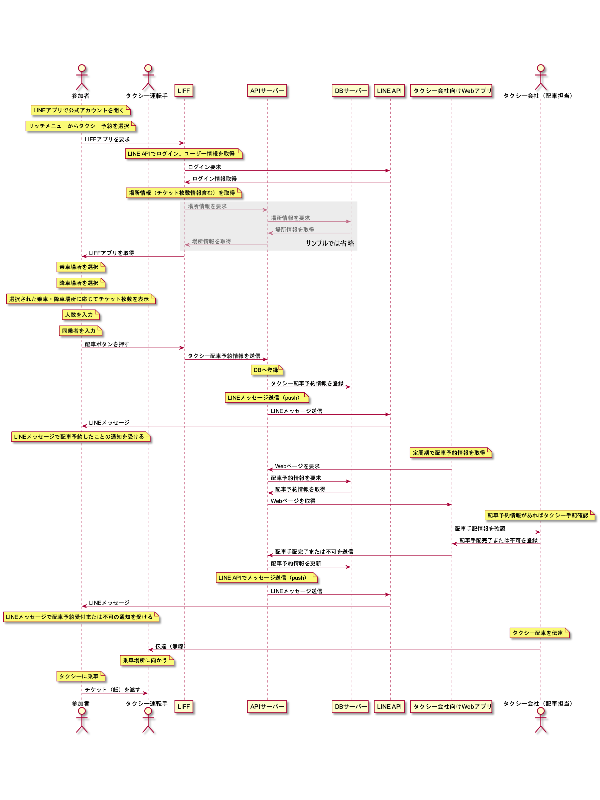

## タクシー配車予約機能

## 全体シーケンス



## サンプルコード

### ディレクトリ構成

以下のような構成で、サンプルコードを格納しています。

```bash
├── .vscode             ... Visual Studio Code 用プロジェクト設定
├── api                 ... Backend API (Azure Functions 対応)
├── public              ... Vue.js プロジェクトの public ディレクトリ
├── src                 ... Vue.js プロジェクトの src ディレクトリ
├── README.md           ... このファイル
└── ...                 ... 静的サイトのファイル一式
```

## サンプルコードをローカル環境で実行する

### Backend API (Azure Functions 対応) のセットアップ

Backend API に引き渡す環境変数を設定します。`api/local.settings.example.json` をもとに `api/local.settings.json` を作成し、JSON のそれぞれの値を設定してください。

- `LINE_MESSAGING_API_CHANNEL_ID`
- `LINE_MESSAGING_API_CHANNEL_SECRET`
- `COSMOSDB_ENDPOINT`
- `COSMOSDB_KEY`

各値の詳細は [/iac/terraform/README.md](../iac/terraform/README.md) をご参考ください。

### プロジェクトのセットアップ

初回は、下記を参考に、このディレクトリと `api` ディレクトリでパッケージのインストールを行ってください。

```
npm install
pushd api
npm install
popd
```

### Backend API を含めた Static Web app に基づく開発環境を実行する

下記コマンドで、ローカル環境にて Backend API を含めた開発環境を実行できます。（ `swa-cli.config.json` から設定を読み込んで実行します。）

```bash
swa start
```

タクシー予約一覧は `http://127.0.0.1:4281/` で立ち上がります。
