# LIFFアプリに利用するチャネルを作成する

LIFFアプリに必要なプロバイダとチャネルを作成します。

> - [LINE Front-end Framework | LINE Developers](https://developers.line.biz/ja/docs/liff/)
> - [チャネルを作成する | LINE Developers](https://developers.line.biz/ja/docs/liff/getting-started/)

まず、[LINE Developersコンソール](https://developers.line.biz/console/)にログインします。アカウントの認証を促された場合は、案内に従い認証してください。

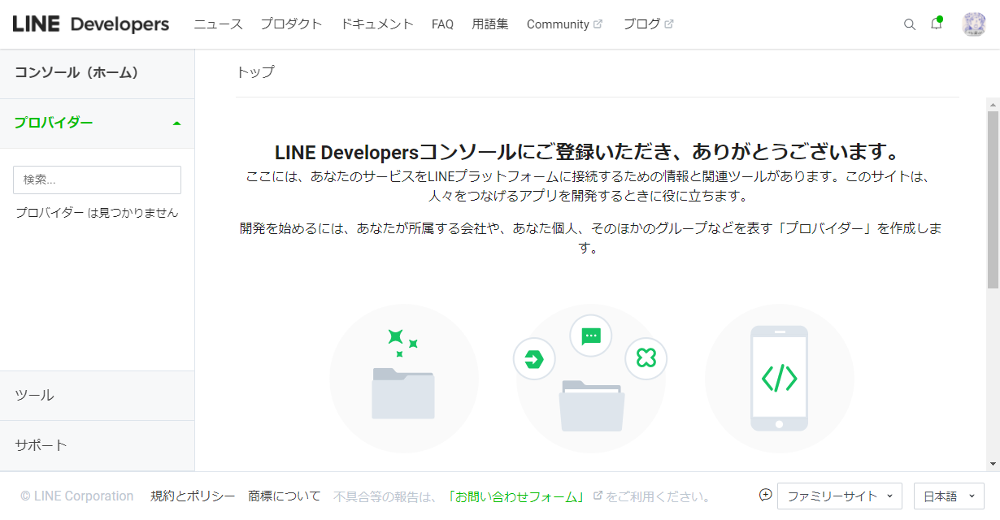

## プロバイダーを作成する

本アプリケーション用に、新規のプロバイダーを作成します。

トップ画面の中央にある「新規プロバイダー作成」ボタンを選択し、下記情報を入力して作成しましょう。

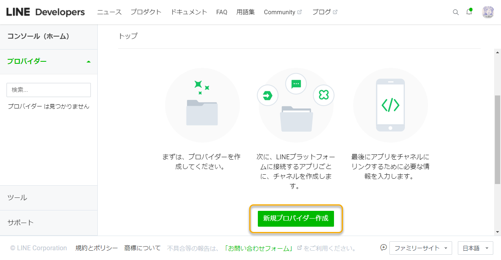

| 項目 | 説明 |
|----|----|
| プロバイダー名 | 任意のプロバイダー名を入力する（`onsen-maas-liffapp` など） |

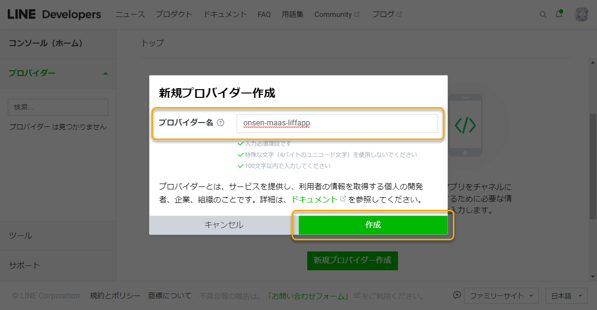

そのプロバイダーの配下に2つのチャネルを作成していきます。

| チャネルの種類 | 説明 |
|----|----|
| LINEログイン | LIFFアプリを登録するためのチャネル |
| Messaging API | ユーザーとメッセージをやり取りするためのチャネル |

## LINEログインチャネルを作成する

作成したプロバイダーの画面で、LINEログインチャネルを作成します。下記項目を入力し、「作成」ボタンから作成してください。

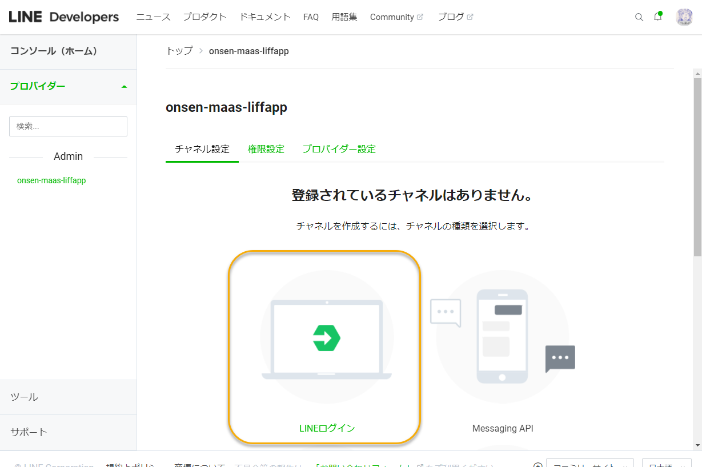

| 項目 | 説明 |
|----|----|
| チャネルの種類 | 「LINEログイン」を指定する |
| プロバイダー | 先ほど作成したプロバイダーを指定する |
| 地域 | 日本 |
| チャネルアイコン | 変更せず（任意で設定する） |
| チャネル名 | 任意のチャネル名を入力する（`onsen-maas-login` など） |
| チャネル説明 | チャネルの説明を入力する |
| アプリタイプ | 「ウェブアプリ」にチェックをつける |
| メールアドレス | メールアドレスを入力する |
| プライバシーポリシーURL | 変更せず（任意で設定する） |
| サービス利用規約URL | 変更せず（任意で設定する） |
| LINE開発者契約の同意 | LINE開発者契約者の内容を確認し、同意としてチェックする |

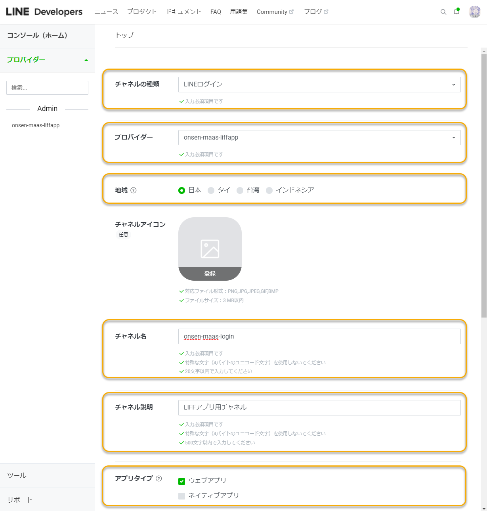
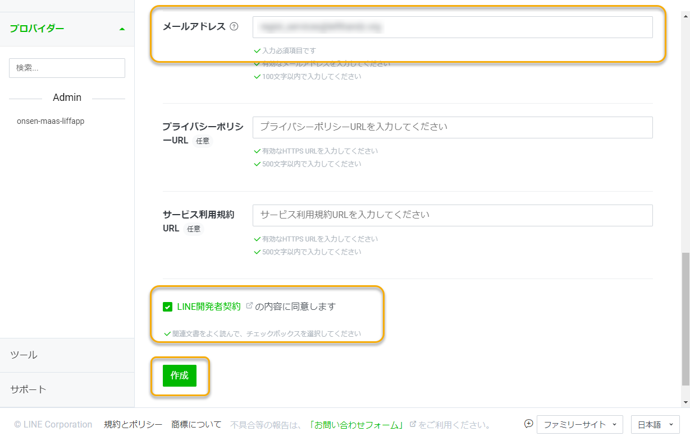

「LIFF」タブで、「追加」ボタンを選択して LIFFアプリを追加します。

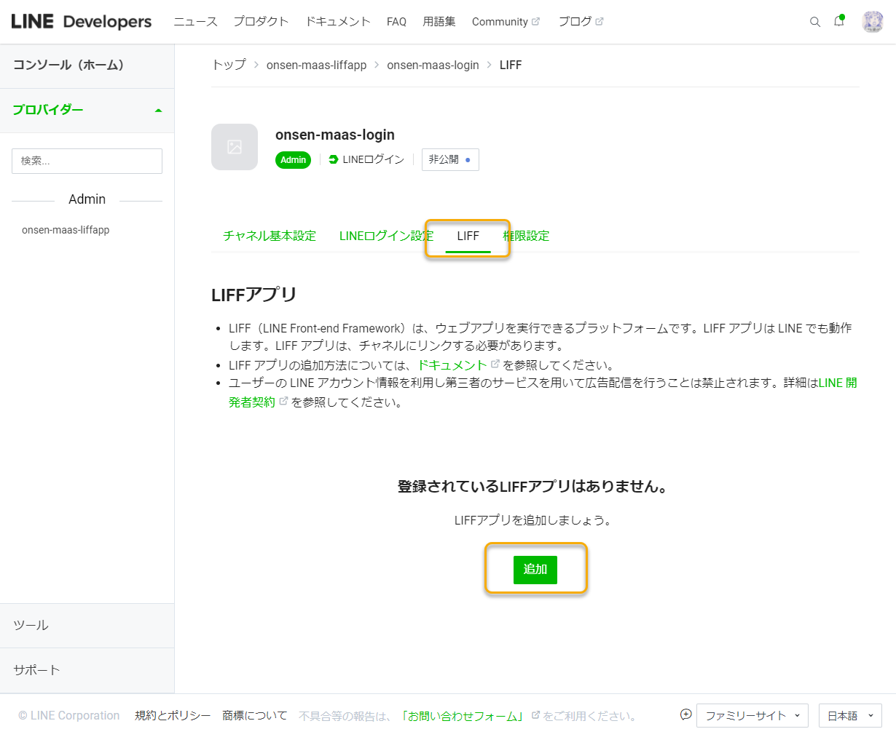

下記項目を入力し、「追加」ボタンからLIFFアプリを追加します。

| 項目 | 説明 |
|----|----|
| LIFFアプリ名 | 任意のLIFFアプリ名を入力する（ `onsen-maas-liffapp` など） |
| サイズ | 「Full」にチェックをつける |
| エンドポイント | 後で差し替えるので、仮に `https://example.com` と入力しておく |
| Scope | 「profile」「openid」にチェックをつける |
| ボットリンク機能 | On (normal) を選択する |
| オプション | 変更せず |

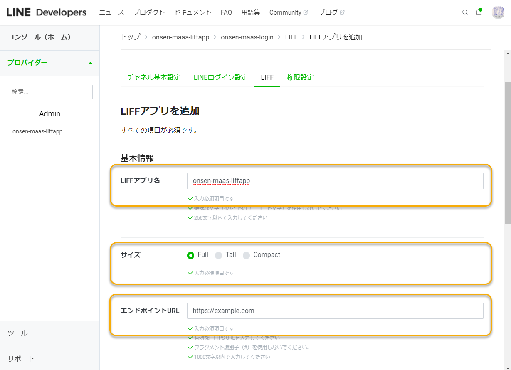
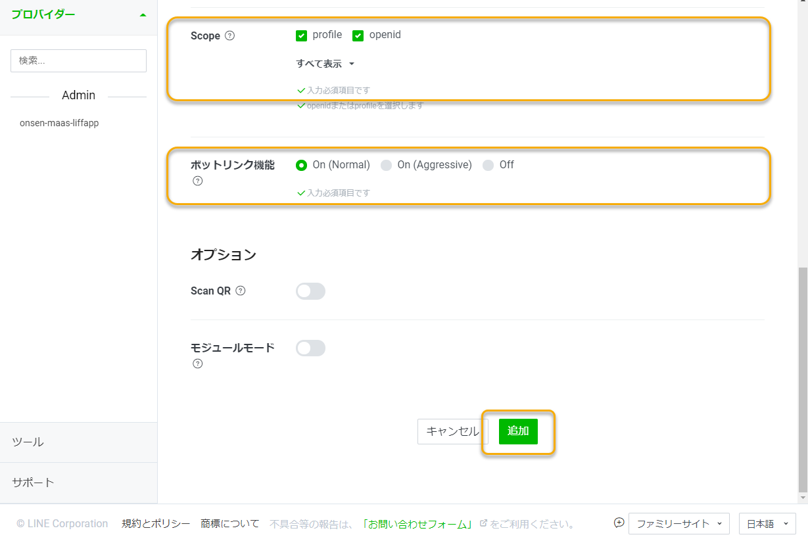

これで LINEログインチャネルと、LIFFアプリの追加ができました。

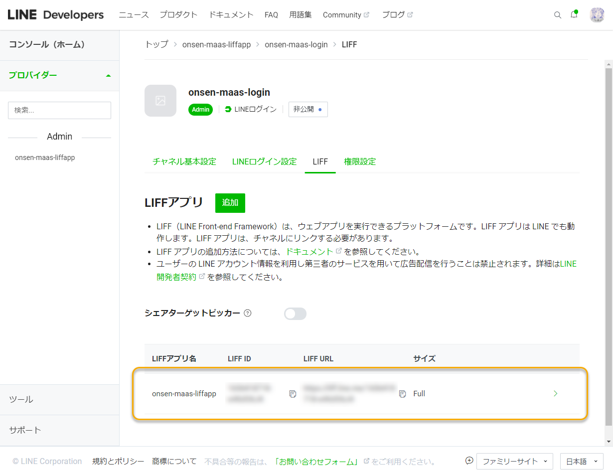

## Messaging API チャネルを作成する

つぎに、Messaging API チャネルを作成します。

一度、プロバイダーのトップ画面に戻り、「新規チャネル作成」を選択します。

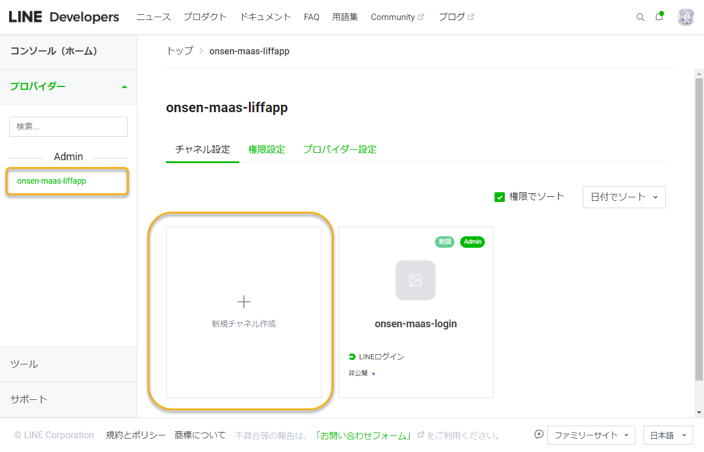

チャネルの種類で「Messaging API」を選択し、必要事項の入力し、「作成」ボタンを選択して進みます。

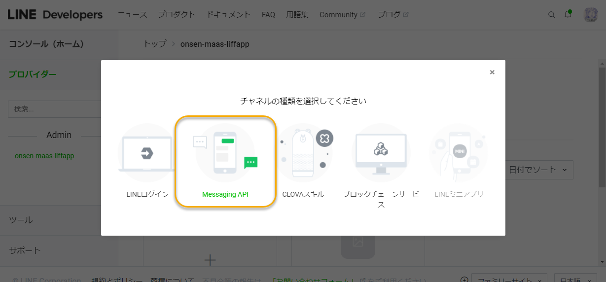

| 項目 | 説明 |
|----|----|
| チャネルの種類 | 「Messaging API」を指定する |
| プロバイダー | 先ほど作成したプロバイダーを指定する |
| チャネルアイコン | 変更せず（任意で設定する） |
| チャネル名 | 任意のチャネル名を入力する（`onsen-maas-messaging` など） |
| チャネル説明 | チャネルの説明を入力する |
| 大業種 | 利用用途に応じて選択する（「交通機関・サービス」など） |
| 小業種 | 利用用途に応じて選択する（「ハイヤー・タクシー」など） |
| メールアドレス | メールアドレスを入力する |
| プライバシーポリシーURL | 変更せず（任意で設定する） |
| サービス利用規約URL | 変更せず（任意で設定する） |
| LINE公式アカウント利用規約の同意 | LINE公式アカウント利用規約の内容を確認し、同意としてチェックする |
| LINE公式アカウントAPI利用規約の同意 | LINE公式アカウントAPI利用規約の内容を確認し、同意としてチェックする |

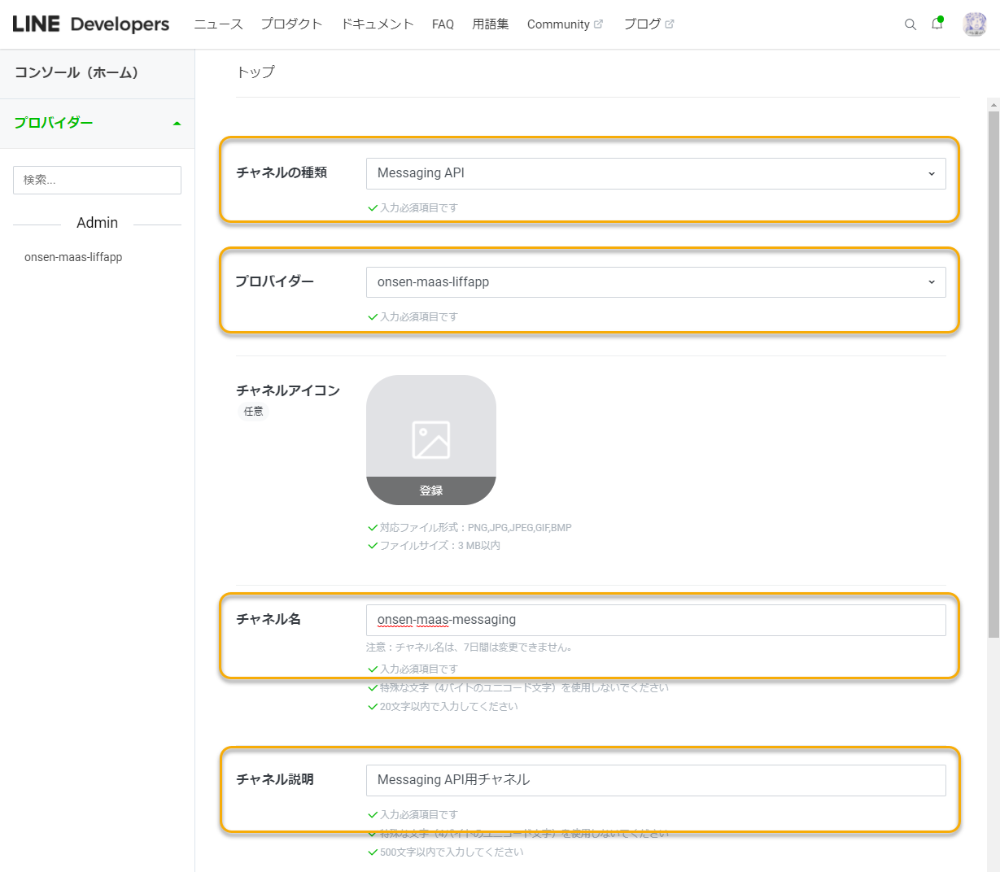
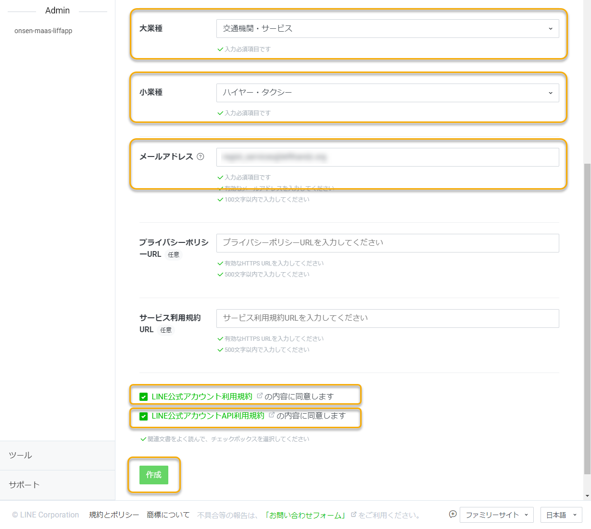

プロンプトが表示されるので確認し、問題なければ「OK」を選択して進みます。

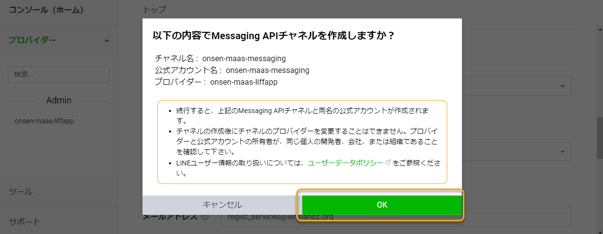
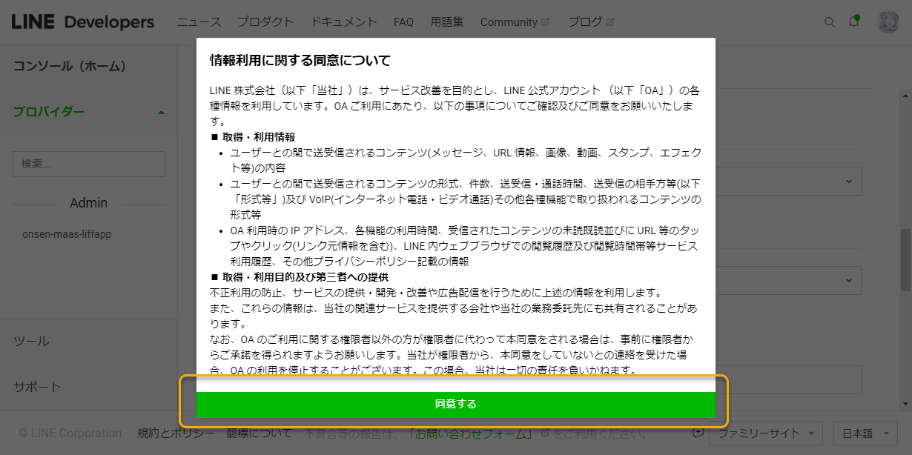
## アプリケーションに設定する値を控えておく

ここで、いくつかの ID やシークレットなどの情報を、あとで利用できるように控えておきましょう。（都度 LINE Developersコンソールを開き、コピーしても構いません。）

| チャネル | 項目 | 説明 |
|----|----|----|
| LINEログイン | チャネルID | 「チャネル基本設定」タブ > 「基本設定」 > 「チャネルID」 |
| LINEログイン | LIFF ID | 「LIFF」タブ > 作成したLIFFアプリ > 「LIFF ID」 |
| LINEログイン | LIFF URL | 「LIFF」タブ > 作成したLIFFアプリ > 「LIFF URL」 |
| Messaging API | チャネルID | 「チャネル基本設定」タブ > 「基本設定」 > 「チャネルID」 |
| Messaging API | チャネルシークレット | 「チャネル基本設定」タブ > 「基本設定」 > 「チャネルシークレット」 |

#### LINEログインチャネルの情報

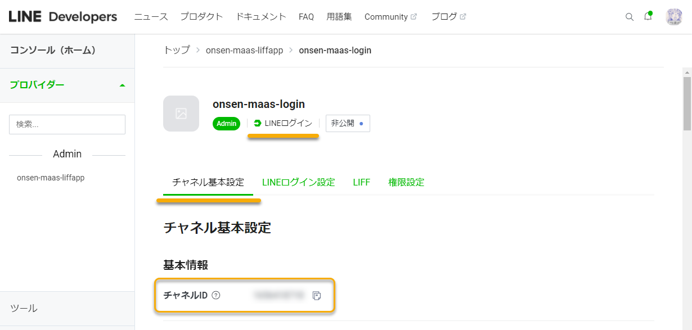

#### LINEログインチャネルの情報（LIFFアプリ）

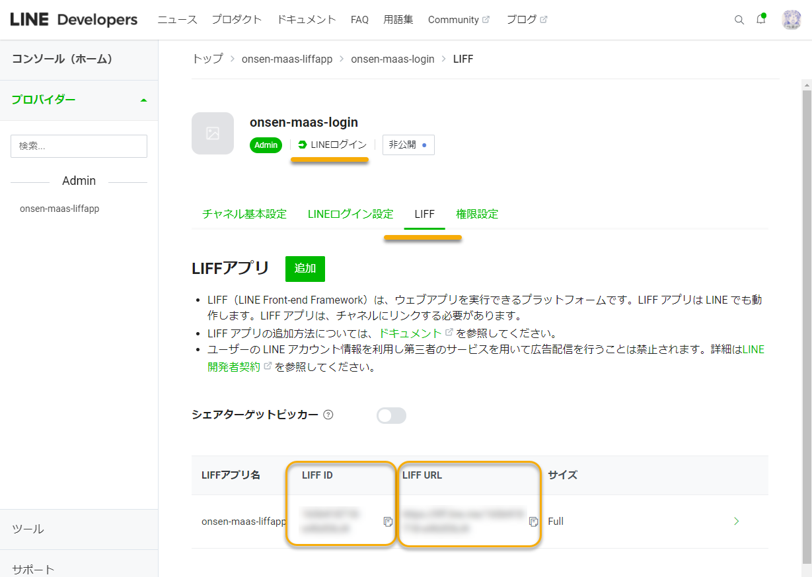

#### Messaging APIチャネルの情報

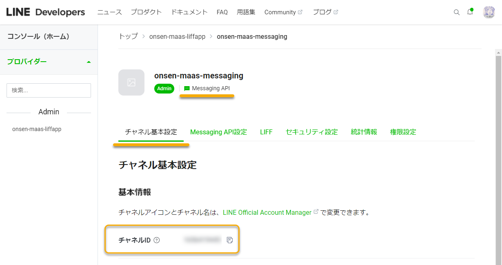
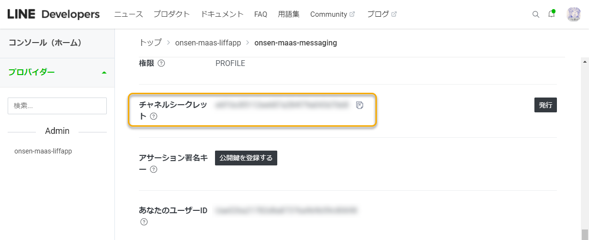
