# Azure のリソースを作成する

このアプリケーションは、下記の Azure サービスを利用して稼働します。

| Azure サービス | 説明 |
|----|----|
| Azure Static Web App (SWA) | LINE LIFFアプリと、バックエンドAPIをホストする |
| Azure Cosmos DB | 配車予約のデータを格納する |

それでは、[Azure ポータル](https://portal.azure.com) を開いて、リソースを作成していきましょう。

## リソース グループを作成する

まず、このハンズオンで利用するリソースをまとめるためのリソース グループを作成します。

「+」（リソースの作成）アイコンを選択し、検索欄で `Resource Group` を検索し、「Resource Group」を選択してください。

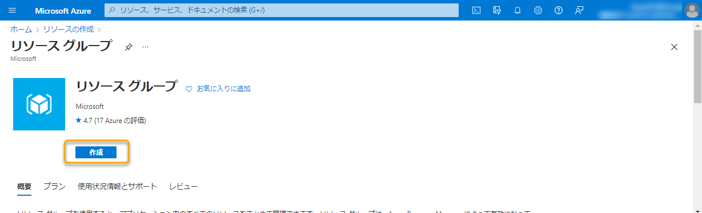

「作成」ボタンを選択し、下記を設定します。「確認および作成」ボタンから内容を確認し、「作成」ボタンを選択してリソース グループを作成します。

| フィールド | 項目 | 説明  |
|----|----|----|
| プロジェクトの詳細 | サブスクリプション | 利用するサブスクリプションを指定する |
| | リソース グループ　| 任意のリソース グループ名を入力する（`rg-onsen-maas-vueapp` など） |
| リソースの詳細 | リージョン | 利用するリージョンを選択する（東日本など） |

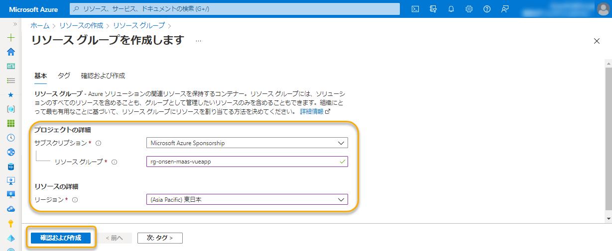

リソース グループの作成が完了したら、「リソースに移動」ボタンなどから作成したリソース グループに移動します。

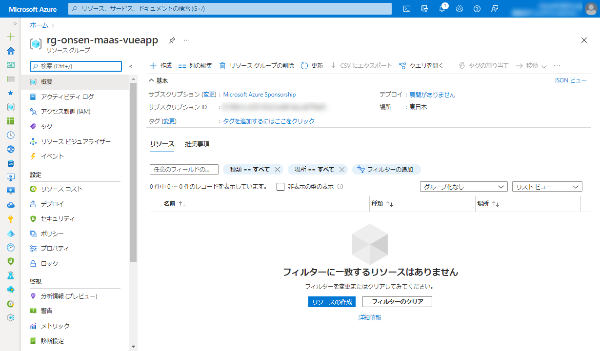

## Azure Cosmos DB を作成する

データベースとして Azure Cosmos DB を作成します。

左上の「+ 作成」から `Azure Cosmos DB` を検索し、「作成」ボタンを選択します。

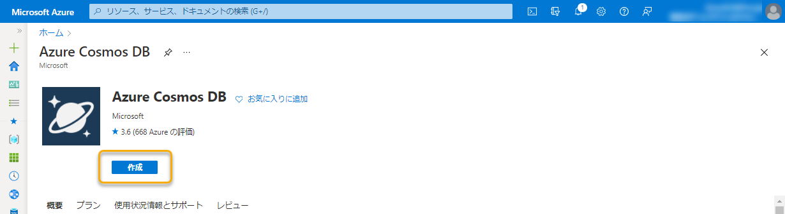

ワークロードの選択では、「コア (SQL) - 推奨」の「作成」に進みます。下記の設定を行い、「レビュー + 作成」ボタンから内容を確認し、「作成」ボタンを選択して Azure Cosmos DB を作成します。

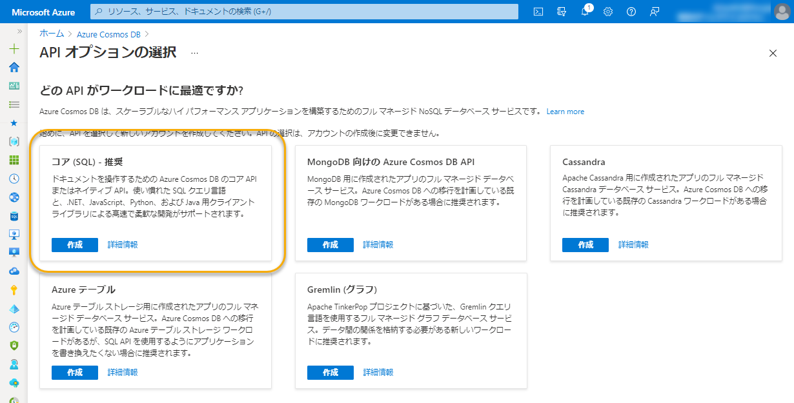

| フィールド | 項目 | 説明 |
|----|----|----|
| プロジェクトの詳細 | サブスクリプション | 前述と同様 |
| | リソース グループ　| 作成したリソース グループを指定する |
| インスタンスの詳細 | アカウント名 | グローバルで一意になるようアカウント名を入力する（ `cosmos-onsen-maas-<your account name>` など） |
| | 場所 | 利用するリージョンを選択する（東日本など） |
| | 容量モード | プロビジョニングされたスループット |
| | Free レベル割引の適用 | 適用 |

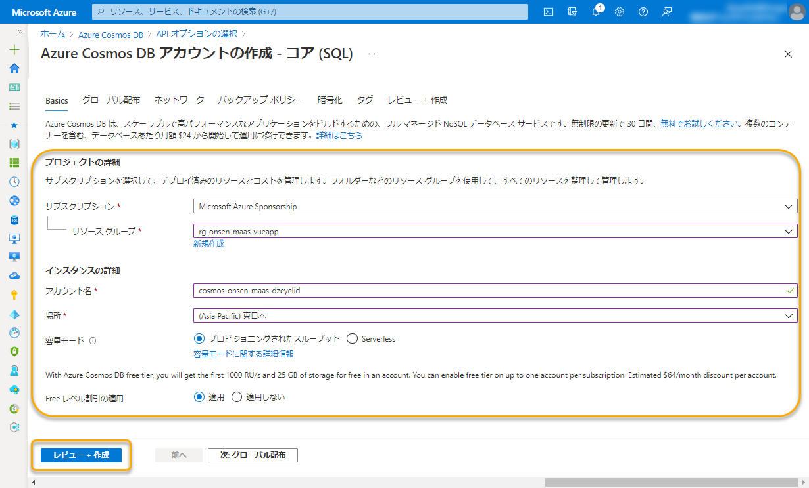

Azure Cosmos DB の作成が完了したら、「リソースに移動」ボタンなどから作成したリソースに移動します。

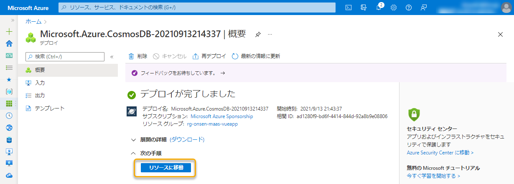

### Azure Cosmos DB のデータベースとコンテナーを作成する

Azure Cosmos DB は、データを格納するためのデータベースとコンテナーを作成する必要があります。

左のメニューから「データ エクスプローラー」を開き、上段メニューの「New Container」を選択し、データベースとコンテナーを作成していきます。

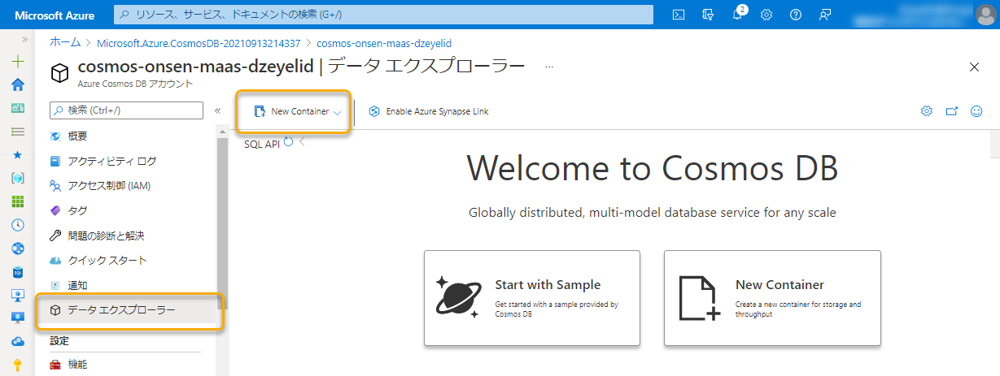

| 項目 | 説明 |
|----|----|
| Database id | 「Create new」を選択し、名前として `TaxiReserveDb` を入力する |
| Share throughput accross containers | チェックを入れたまま |
| Database throughput | 「Autoscale」を選択し、RU/s の値を入力する（初期値の `4000` でよい） |
| Container id | `TaxiReserveCol` を入力する |
| Indexing | 「Automatic」を選択する |
| Partition key | `/userId` を入力する |
| Unique keys | 変更せず |
| Analytical store | 変更せず |
| Advanced | 変更せず |

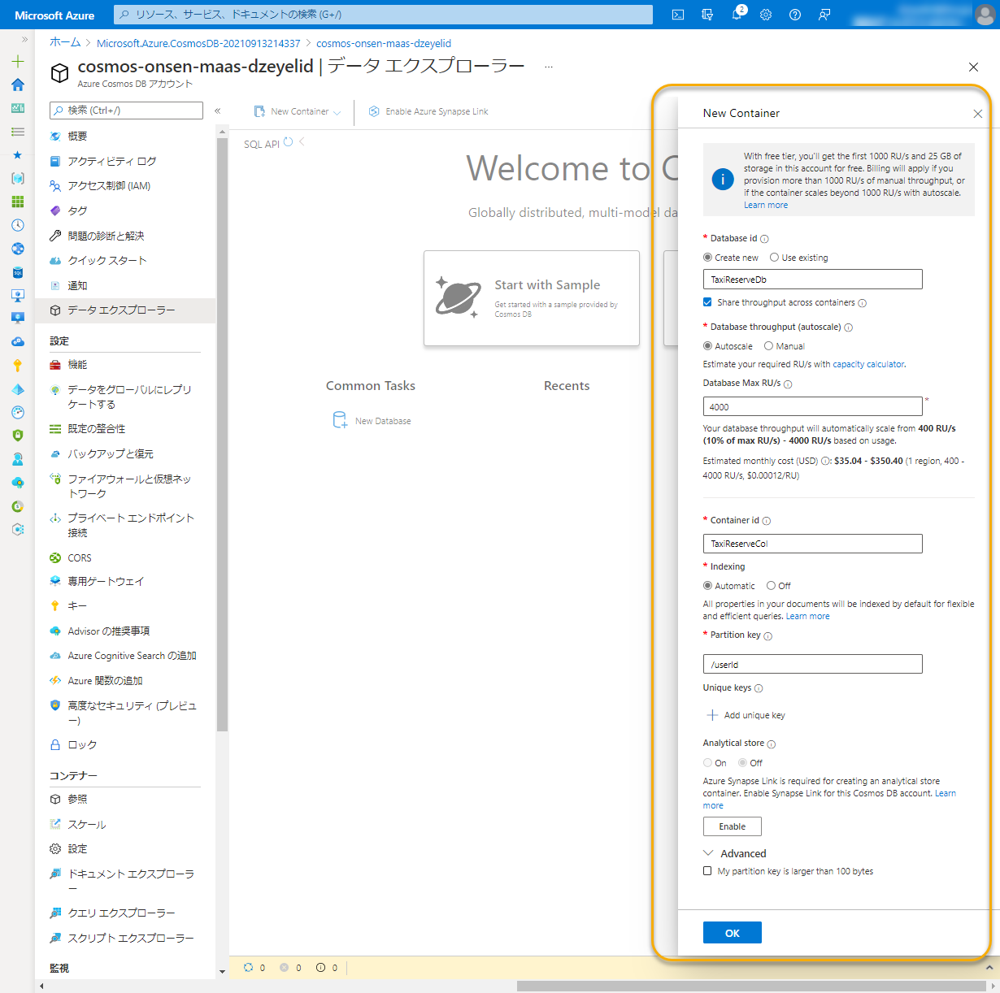

設定を終えたら、「OK」ボタンを選択して、データベースとコンテナーを作成します。

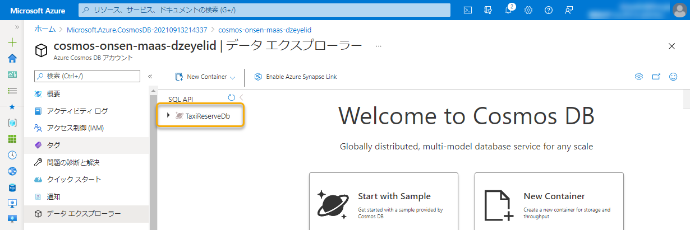

### Azure Cosmos DB の接続文字列を控える

さらに、アプリケーションから Azure Cosmos DB にアクセスするための接続文字列を確認しましょう。

左のメニューの「キー」を開き、「プライマリ接続文字列」を控えておいてください。

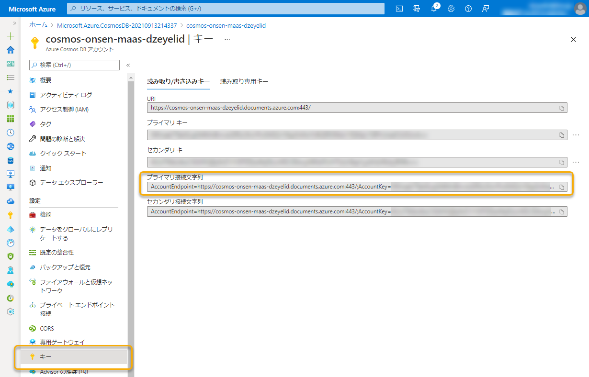

## Azure Static Web App を作成する

次に、作成したリソース グループの中に Azure Static Web App を作成します。

再度リソース グループの画面に戻り、「+ 作成」から `Static Web App` を検索し、「作成」ボタンを選択します。

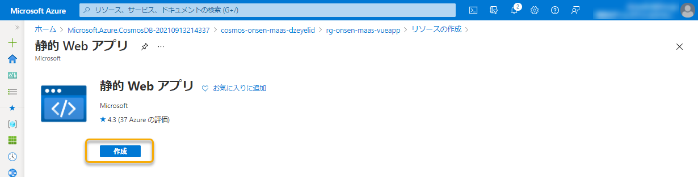

下記のように設定し、「確認および作成」ボタンから内容を確認し、「作成」ボタンを選択して Azure Static Web App を作成します。

| フィールド | 項目 | 説明 |
|----|----|----|
| プロジェクトの詳細 | サブスクリプション | 前述と同様 |
| | リソース グループ　| 作成したリソース グループを指定する |
| 静的 Web アプリの詳細 | 名前 | 任意の静的 Web アプリの名前を入力する（`stapp-onsen-maas-vueapp` など） |
| ホスティング プラン | プランの種類 | 「Free: 趣味または個人的なプロジェクト用」を選択する |
| Azure Functions とステージングの詳細 | Azure Functions API とステージング環境のリージョン | 利用するリージョンを選択する（日本はないのでお好みで） |
| デプロイの詳細 | ソース | 「GitHub」を選択する |
| | GitHub アカウント | 「GitHub アカウントでサインイン」ボタンから、GitHub アカウントに接続する |
| | 組織 | 利用するGitHubアカウント（または組織）を指定する |
| | リポジトリ | 先ほどフォークしたリポジトリ `onsen-maas-vueapp` を指定する |
| | 分岐 | 対象のブランチ `main` を指定する |
| ビルドの詳細 | ビルドのプリセット | 「Vue.js」を指定する |
| | アプリの場所 | 変更せず |
| | API の場所 | `api` と入力する |
| | 出力先 | 変更せず |

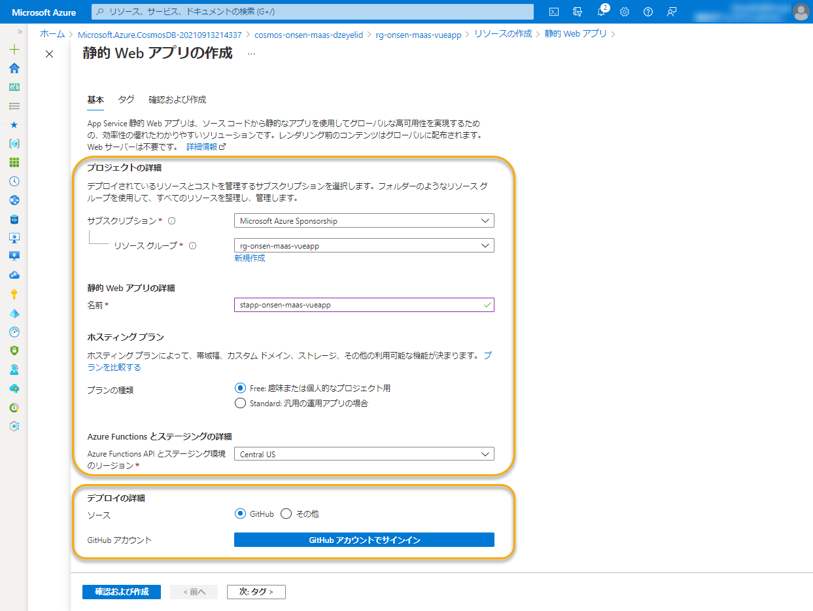

「GitHub アカウントでサインイン」ボタンを選択すると、Azure Static Web App が GitHub へアクセスするための許可を聞かれます。問題ないことを確認し、「Authorize Azure-App-Service-Static-Web-Apps」を選択して進んでください。

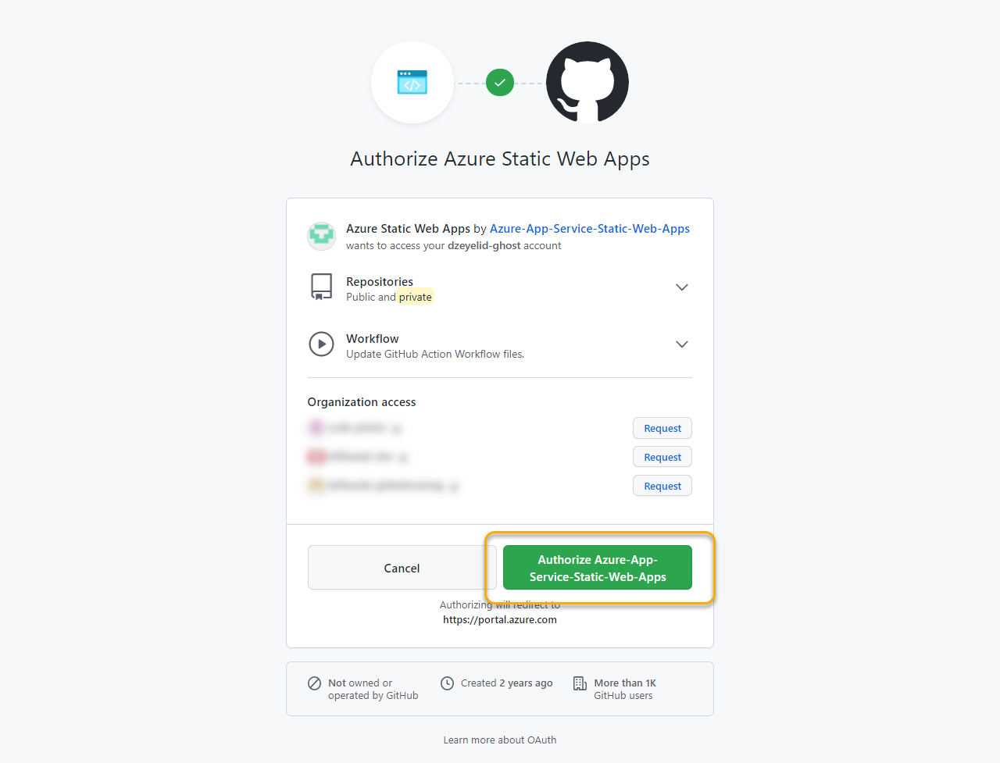

Azure ポータルに戻ると、リポジトリの選択以降の項目を入力できるようになるので、上表を参考に入力し、「確認および作成」ボタンから作成します。

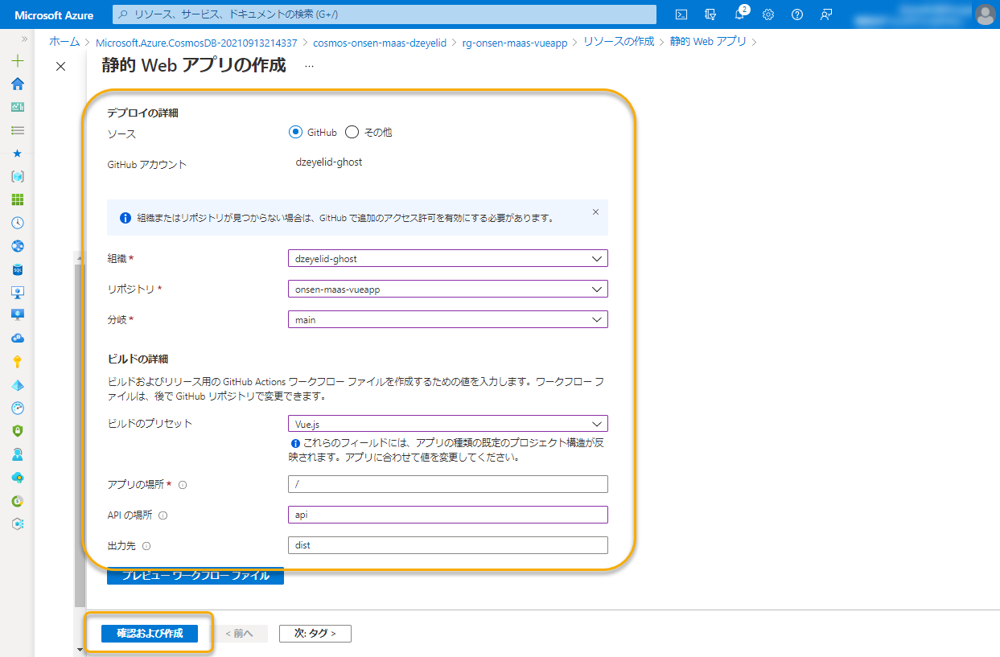

Azure Static Web App の作成が完了したら、「リソースに移動」ボタンなどから作成したリソースに移動します。

### Azure Static Web App のアプリケーション設定を追加する

左のメニューから「構成」を開き、「アプリケーション設定」の「環境」のプルダウンが「Production」であることを確認します。

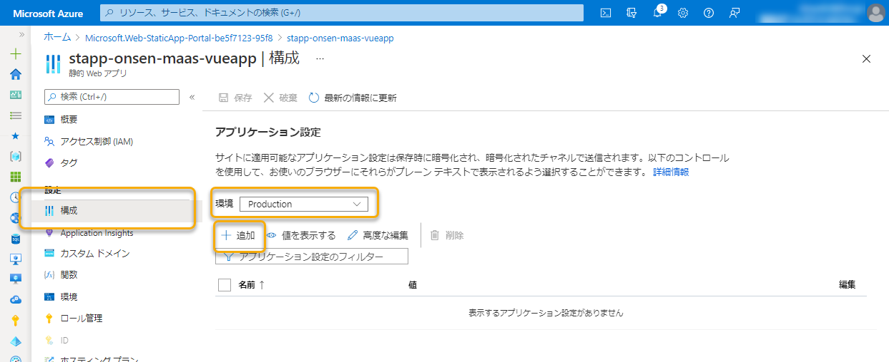

「+ 追加」から「アプリケーション設定の追加」に進み、下記の4件の設定を追加します。最後に上部の「保存」を選択して忘れずに保存してください。

| 項目 | 説明 |
|----|----|
| 名前 | `COSMOS_CONNECTION` |
| 値 | 前述で取得した Cosmos DB のプライマリ接続文字列 |

| 項目 | 説明 |
|----|----|
| 名前 | `LINE_LOGIN_CHANNEL_ID` |
| 値 | LINEログインチャネルの「チャネルID」 |

| 項目 | 説明 |
|----|----|
| 名前 | `LINE_MESSAGING_API_CHANNEL_ID` |
| 値 | Messaging API チャネルの「チャネルID」 |

| 項目 | 説明 |
|----|----|
| 名前 | `LINE_MESSAGING_API_CHANNEL_SECRET` |
| 値 | Messaging API チャネルの「チャネルシークレット」 |

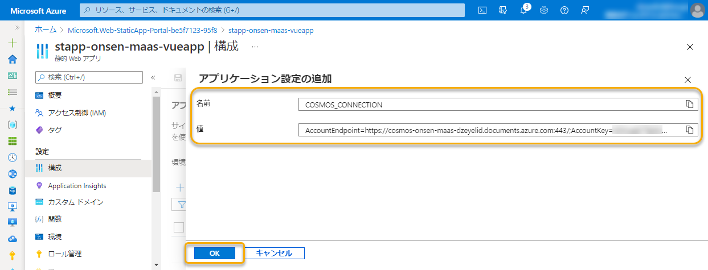

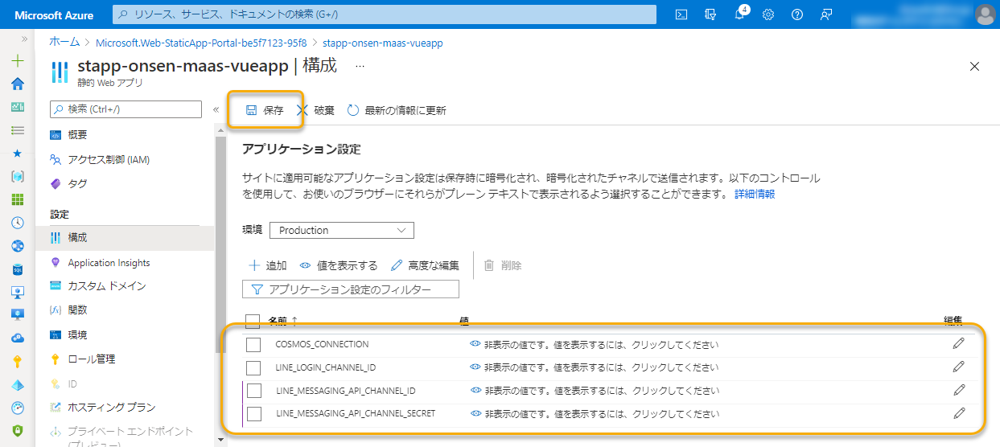

### Azure Static Web App のサイトを確認する

それでは、Azure Static Web App の概要ページにある URL を開いてみましょう。すると、「タクシー配車予約」アプリがデプロイされていることが確認できます。

ただし、この状態では LINE との接続がされていないので、正しく動作しません。引き続き作業を進めましょう。

なお、この URL を次の手順で使うので、コピーしたままにするか、どこかに控えておいてください。

----

[README に戻る](./#3-azure-のリソースを作成する)
