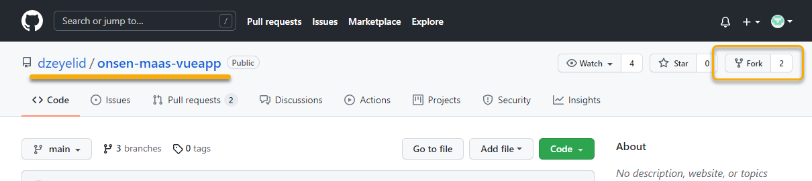
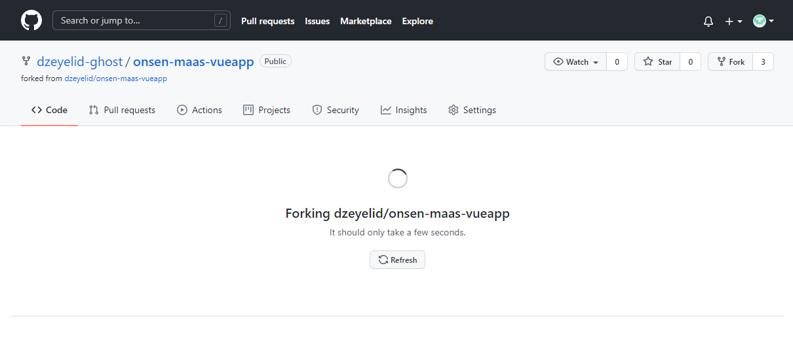
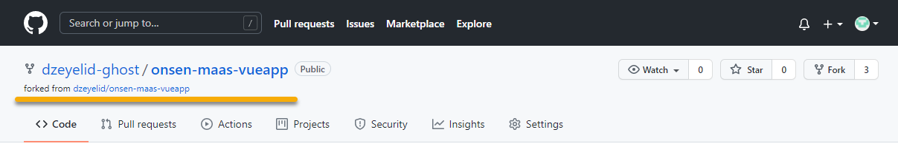

# GitHubリポジトリを準備する

静的サイトのホストに利用する Azure Web Static Web App は、CI/CDで連携するリポジトリが必要になります。ここでは、標準でサポートされているGitHubを利用します。

## 本リポジトリをフォークする

本リポジトリのサンプルコードを利用したいので、ご自身のアカウント配下にフォークしましょう。

GitHubにサインインした状態で、本リポジトリ [dzeyelid/onsen-maas-vueapp](https://github.com/dzeyelid/onsen-maas-vueapp/) を開き、右上の「Fork」からフォークします。

----

[README に戻る](./#2-githubリポジトリを準備する)
